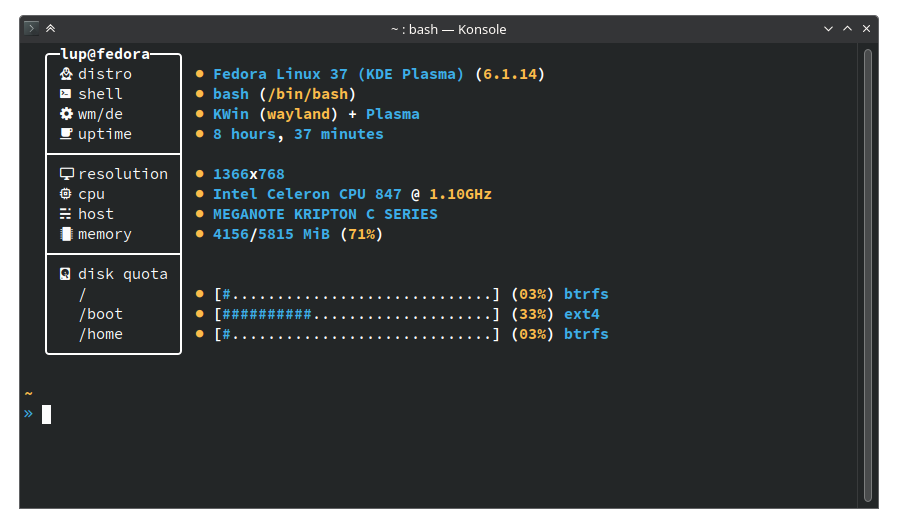

# Lubby
🐧 Another Linux fetcher.

     
    

 

I was bored and decided to make my own fetch just for fun. This probably breaks / doesn't work on most people's computers, but it runs fine on mine, which is what matters.

## Dependencies

### Required
- `bash 5`
- `xprop`
- `df`
### Recommended
- `Nerd Fonts`

## Installing

Download the `lubby` script to your `$PATH` and mark it as executable (`chmod +x lubby`)

## Todo

- [ ] Add terminal flags
- [ ] Add proper debugging support

## Inspiration

| |
| :------------ | 
| [Grabby v2][insp_grabby] *(now deleted)* |
| [nitch][insp_nitch] |
| [hyfetch][insp_hyfetch] |
| [fet.sh][insp_fet.sh] |

<!-- Inspirations -->
[insp_grabby]: https://github.com/sannfdev/grabby
[insp_nitch]: https://github.com/dylanaraps/pfetch
[insp_hyfetch]: https://github.com/hykilpikonna/hyfetch
[insp_fet.sh]: https://github.com/6gk/fet.sh