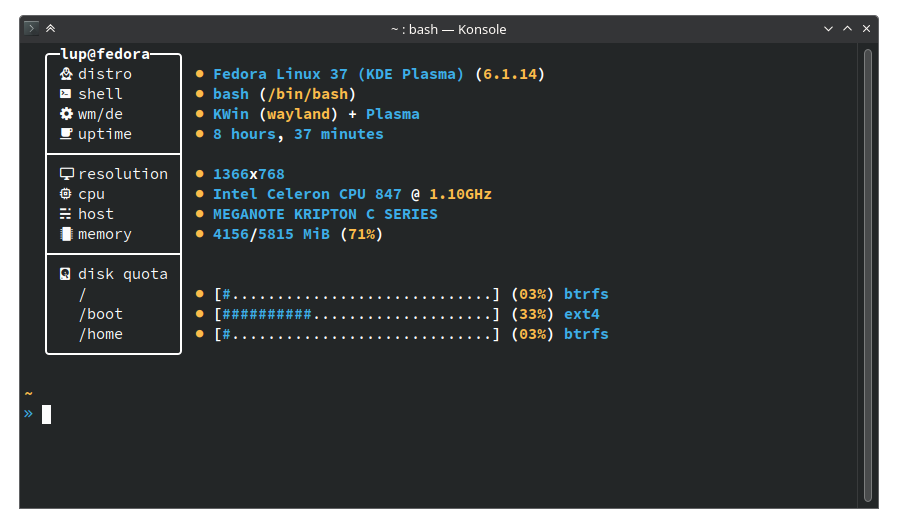

<div align="center">
    <hr />
    <h3 align="center"></h3>
    <p>Another system information fetch script written in BASH</p>
    <hr />
</div>



I was bored and decided to make my own fetch just for fun. This probably breaks / doesn't work on most people's computers, but it runs fine on mine, which is what matters.

While Lubby does provide useful information, such as RAM consumption and disk usage, you should generally take these as *gross* estimates. For more accurate system statistics and diagnostics, consider using a proper system diagnostic tool.

<br />

## Installing

Downloading
```sh
git clone https://github.com/LupSpie/lubby; cd "${_##*/}"
```

Copying to `$PATH` *(optional)*
```sh
cp lubby $HOME/.local/bin
```

## Using

Just call the script's name.
```sh
./lubby # If just downloading
lubby   # If copied to your $PATH
```

### Inspirations
- [Grabby v2][insp_grabby] *(now deleted)*
- [nitch][insp_nitch]
- [hyfetch][insp_hyfetch]
- [fet.sh][insp_fet.sh]

<!-- Inspirations -->
[insp_grabby]: https://github.com/sannfdev/grabby
[insp_nitch]: https://github.com/dylanaraps/pfetch
[insp_hyfetch]: https://github.com/hykilpikonna/hyfetch
[insp_fet.sh]: https://github.com/6gk/fet.sh
