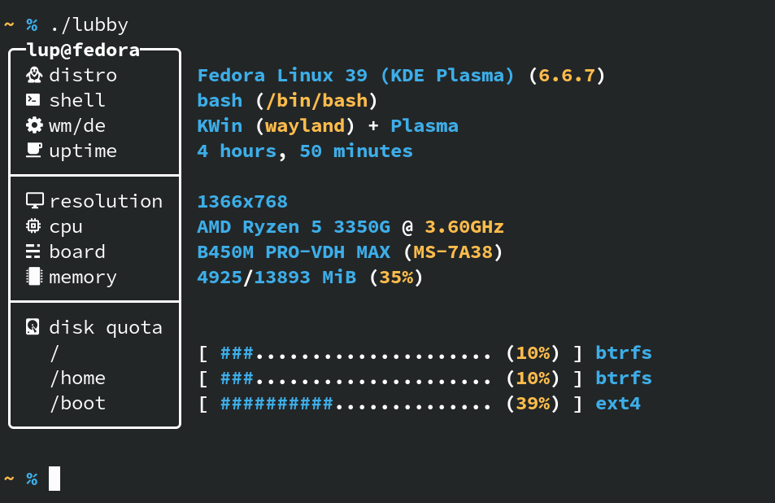

<div align="center">
    <h3 align="center"></h3>
    <p>Yet another sysfetch script written in BASH</p>
    <hr />
</div>



## What is it?

Lubby is my attempt at making something simple, yet elegant to display system information. It started as a byproduct of my (then) slow ass PC being too slow to run other fetch scripts properly.

## Where can I run it?

Lubby is first and foremost a personal project, so I can't guarantee it will function properly on your machine (like, at all).

What I can tell you, however, is where I expect it to be able to run: on **Linux desktops**.

## How's it different from `X`?

Honestly, probably not very much. If you're happy with what you're currently using, then more power to you. _I'd still recommend you try it ;)_

## Alright, how can I get it?

Firstly, make sure that you've got a [nerd font](https://github.com/ryanoasis/nerd-fonts) installed, plus some other X11 stuff like xprop.

Then, just run the following on your terminal (_be sure to have git installed_):

```sh
git clone https://github.com/LupSpie/lubby; cd "${_##*/}"
```

If you want to, you can also add it to your `$PATH`. You should check where it is located (`echo $PATH`). Here is an example:

```sh
cp lubby $HOME/.local/bin
```

## Configuration

Lubby doesn't have a configuration file, all of its customization is done either inside of the script itself, or by using environment variables.

### Functionality _(environment variables)_

```sh
# Overrides the default user@hostname header. If set, will overwrite the default box width.
# Default: LUB_CUSTOM_TITLE=<user@hostname>
# Example: LUB_CUSTOM_TITLE="AWESOME PC"
LUB_CUSTOM_TITLE=<string>

# Boolean that allows you to hide the header. If set, will override LUB_CUSTOM_TITLE and hide the header for the box.
# Default: LUB_CUSTOM_TITLE=0
# Example: LUB_CUSTOM_TITLE=1
LUB_NO_TITLE=<0|1>

# Overrides the minimum width of the box that contains the labels. Measured in characters.
# Default: LUB_BOX_WIDTH=12
# Example: LUB_BOX_WIDTH=69
LUB_BOX_WIDTH=<int>

# Define a regex pattern for locating the drives using DF.
# Default: LUB_CUSTOM_TITLE="/sda*"
# Example: LUB_CUSTOM_TITLE="/*"
LUB_DISK_REGEX=<string>

# Forces a custom width for the bar representing your disk space usage.
# Default: LUB_DISK_BAR_WIDTH=25
# Example: LUB_DISK_BAR_WIDTH=7
LUB_DISK_BAR_WIDTH=<int>
```

### Appearance _(inside of the script)_

```sh
# Labels
readonly LABEL_DISTRO=' distro'          # Default: ' distro'
readonly LABEL_SHELL=' shell'            # Default: ' shell'
readonly LABEL_WM_DE=' wm/de'            # Default: ' wm/de'
readonly LABEL_UPTIME=' uptime'          # Default: ' uptime'
readonly LABEL_RESOLUTION=' resolution'  # Default: ' resolution'
readonly LABEL_CPU=' cpu'                # Default: ' cpu'
readonly LABEL_BOARD=' board'            # Default: ' board'
readonly LABEL_MEMORY=' memory'          # Default: ' memory'
readonly LABEL_DISK=' disk quota'        # Default: ' disk quota'
# Icons
readonly SYMBOL_DISK_FILLED='#'           # Default: '#'
readonly SYMBOL_DISK_REMAINDER='.'        # Default: '.'
readonly SYMBOL_SEPARATOR=''                 # Default: ''
# Colors ~ https://gist.github.com/iamnewton/8754917
readonly COLOR_RESET='\033[m'             # Default: '\033[m'
readonly COLOR_BASE='\033[1;37m'          # Default: '\033[1;37m'
readonly COLOR_PRIMARY='\033[1;34m'       # Default: '\033[1;34m'
readonly COLOR_SECONDARY='\033[1;33m'     # Default: '\033[1;33m'
# Box
readonly BOX_UPPER_LEFT='\xe2\x95\xad'    # Default: '\xe2\x95\xad'
readonly BOX_UPPER_RIGHT='\xe2\x95\xae'   # Default: '\xe2\x95\xae'
readonly BOX_BOTTOM_LEFT='\xe2\x95\xb0'   # Default: '\xe2\x95\xb0'
readonly BOX_BOTTOM_RIGHT='\xe2\x95\xaf'  # Default: '\xe2\x95\xaf'
readonly BOX_DIVIDER_LEFT='\xe2\x94\x9c'  # Default: '\xe2\x94\x9c'
readonly BOX_DIVIDER_RIGHT='\xe2\x94\xa4' # Default: '\xe2\x94\xa4'
readonly BOX_HORIZONTAL='\xe2\x94\x80'    # Default: '\xe2\x94\x80'
readonly BOX_VERTICAL='\xe2\x94\x82'      # Default: '\xe2\x94\x82'
```

## Inspirations

**`grabby v2`** by sannfdev _(now deleted)_

[**`nitch`**](https://github.com/ssleert/nitch) by ssleert

[**`pfetch`**](https://github.com/dylanaraps/pfetch) by dylanaraps

[**`hyfetch`**](https://github.com/hykilpikonna/hyfetch) by hykilpikonna

[**`fet.sh`**](https://github.com/6gk/fet.sh) by 6gk

[**`sysfetch`**](https://github.com/wick3dr0se/sysfetch) by wick3dr0se
